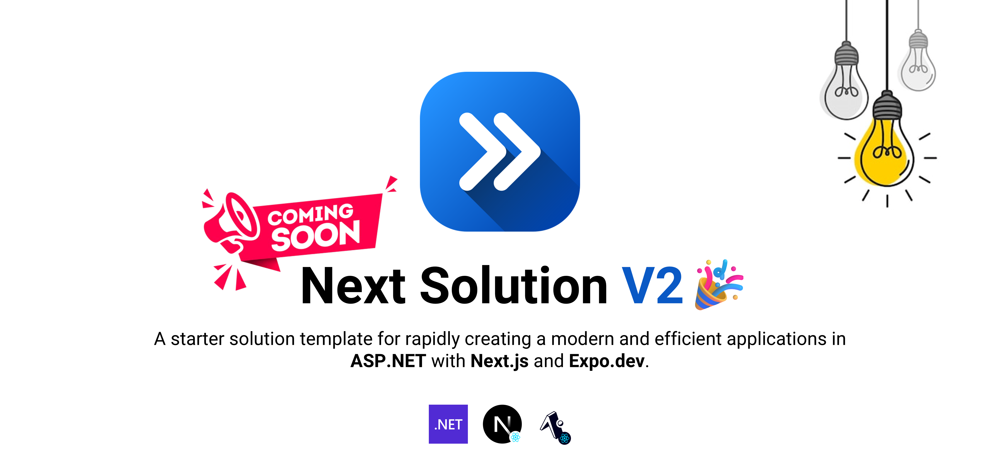

<div align="center">

[](https://github.com/prince272/nextsolution)

[](https://www.nuget.org/packages/NextSolution.Template)
[](https://github.com/prince272/nextsolution/blob/main/LICENSE)
[](https://www.nuget.org/packages/NextSolution.Template)

</div>


# NextSolution V2 (ASP.NET API with Next.js, and Expo) 🚀

This starter template combines an [ASP.NET API](https://dotnet.microsoft.com/apps/aspnet) 🖥️ with a [Next.js (React)](https://nextjs.org/) web application 🌐 and an [Expo (React Native)](https://expo.dev/) mobile app 📱 to provide a solid foundation for building full-stack applications with powerful APIs and responsive web and mobile interfaces.

## Motivation

🚀 After releasing the initial version of the [NextSolution template](https://github.com/prince272/nextsolution) on [NuGet](https://www.nuget.org/packages/NextSolution.Template), I observed a gradual increase in both NuGet downloads and GitHub stars over a few months. This positive feedback was a significant motivator for me to develop V2, which features an improved codebase and more organized patterns.

🤔 If you find the next solution is useful, please give it a star ⭐ and consider sponsoring. Your support helps me keep improving it. Thanks!

## Demo


## Getting Started

Follow these steps to get your development environment up and running.

### Prerequisites

Before you begin, ensure you have the following installed:

- [Visual Studio 2022 or later](https://visualstudio.microsoft.com/downloads/)
- [Visual Studio Code](https://code.visualstudio.com/) (optional)
- [.NET 8.0 SDK](https://dotnet.microsoft.com/download/dotnet/8.0) (latest version)
- [Node.js v20](https://nodejs.org/en/) (latest version,  only required if you are using Next.js or Expo)
  
### Installation

To set up your project using the NuGet template, follow these steps:

1. **Install the NuGet template:**

   Open your terminal or command prompt and run the following command to install the template:

   ```bash
   dotnet new --install NextSolution.Template::2.0.0
   ```
   

2. **Create a New Project Using the Template:**

   After installing the template, you can either continue using the terminal or command prompt, or switch to Visual Studio to create the new project:

   - **Using the terminal or command prompt:**

     Generate a new project by running the following command. Replace `YourProjectName` with your desired project name:

     ```bash
     dotnet new nextsln -o YourProjectName
     ```

     Move into the newly created project directory:

     ```bash
     cd YourProjectName
     ```

     Restore the project dependencies:

     ```bash
     dotnet restore
     ```

     Open the solution file in Visual Studio:

     ```bash
     start YourProjectName.sln
     ```

   - **Using Visual Studio:**

     Open Visual Studio, select "Create a new project," search for "Next Solution," select it, and follow the prompts to create your project.

## Tools, Frameworks & Libraries

This template was built using a variety of powerful frameworks and tools, including those listed below and many others:

[](https://dotnet.microsoft.com/) [](https://ngrok.com/) [](https://jwt.io/) [](https://docs.microsoft.com/en-us/ef/) [](https://automapper.org/) [](https://fluentvalidation.net/) [](https://flurl.dev/) [](https://github.com/Humanizr/Humanizer) [](https://github.com/libphonenumber/libphonenumber-csharp) [](https://github.com/jstedfast/MailKit) [](https://oauth.net/) [](https://serilog.net/) [](https://www.twilio.com/) [](https://swagger.io/) [](https://reactjs.org/) [](https://reactnative.dev/) [](https://reactnavigation.org/) [](https://axios-http.com/) [](https://expo.dev/) [](https://lodash.com/) [](https://nativewind.dev/) [](https://react-hook-form.com/) [](https://github.com/pmndrs/zustand) [](https://code.visualstudio.com/) [](https://visualstudio.microsoft.com/) [](https://developer.android.com/studio) [](https://git-scm.com/) [](https://github.com/features/copilot) [](https://nodejs.org/) [](https://reactnativepaper.com/) [](https://nextui.org/)


## License

This template is distributed under the MIT License. Please refer to the [LICENSE](./LICENSE.txt) for further details.

## Acknowledgments

With gratitude, I acknowledge these libraries, tools, and documentation which played a crucial role in the creation of this template.

**Documentation:**
- [React Official Site](https://react.dev/)
- [React Native Official Site](https://reactnative.dev/)
- [YouTube: React Native for Beginners](https://www.youtube.com/watch?v=0-S5a0eXPoc&t=1918s)
- [YouTube: Understanding React Native Performance](https://www.youtube.com/watch?v=lA_73_-n-V4)
- [W3Schools: TypeScript](https://www.w3schools.com/typescript/)

**Tools, Frameworks & Libraries:**
- [React Hook Form](https://react-hook-form.com/)
- [Tailwind CSS](https://tailwindcss.com)
- [React Native Paper](https://reactnativepaper.com/)
- [Expo with React Native](https://expo.dev/)
- [GitHub: FluffySpoon.Ngrok](https://github.com/ffMathy/FluffySpoon.Ngrok)
- [GitHub: ASP.NET Core JWT Authentication](https://github.com/VahidN/ASPNETCore2JwtAuthentication)

**Architecture & Design:**
- [GitHub: Clean Architecture](https://github.com/jasontaylordev/CleanArchitecture)
- [UXWing: Free Icons](https://uxwing.com/)
- [Best-README-Template](https://github.com/othneildrew/Best-README-Template)
- [Gist: .NET Project Structure](https://gist.github.com/davidfowl/ed7564297c61fe9ab814)
- [GitHub: .NET Template Reference](https://github.com/dotnet/templating/wiki/Reference-for-template.json)
- [Gist: Conventional Commit Messages](https://gist.github.com/qoomon/5dfcdf8eec66a051ecd85625518cfd13?permalink_comment_id=4892033)
- [Gist: Git Commit Message Emoji](https://gist.github.com/parmentf/035de27d6ed1dce0b36a)